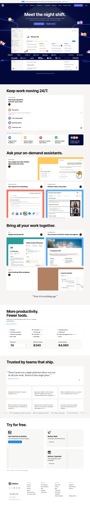
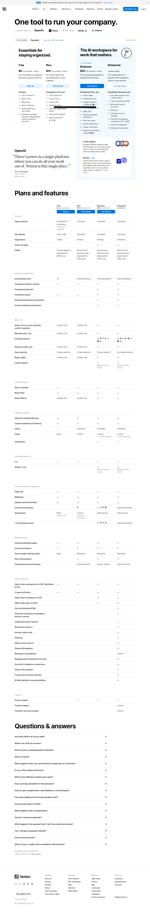

# Competitor Intelligence Report: Notion
*Generated: 2026-05-21 14:21*

---

## Executive Summary

Notion has solidified its position as a leading all-in-one productivity and collaboration workspace, combining note-taking, task tracking, databases, and advanced AI capabilities into a single platform. As of 2026, Notion commands approximately 6.24% market share in the project management category with over 17,771 companies using the platform, including enterprise clients like PwC, Atento, and SoftBank [source](https://www.datanyze.com/market-share/project-management--217/notion-software-market-share). The platform's competitive advantage lies in its flexibility, customization capabilities, and increasingly sophisticated AI integration—particularly recent features like GitHub-powered AI answers and webhook automation supporting 1,000+ integrations. However, Notion faces significant competitive pressure from established players like Jira (36.91% market share) and Microsoft Project (9.62%), alongside emerging alternatives like ClickUp and Airtable. Recent pricing changes in 2024-2025 have generated user friction, presenting an opportunity for competitors to capture price-sensitive segments.

---

## Company Overview

**What Notion Does:**
Notion is a unified workspace platform that enables individuals and teams to create notes, manage tasks, build wikis, organize databases, and collaborate on projects—all within a single interface [source](https://firebearstudio.com/blog/what-is-notion.html). The platform targets freelancers, students, small teams, and enterprise organizations seeking to consolidate fragmented tool stacks.

**Target Market:**
- **Primary**: Remote teams, startups, and knowledge workers
- **Secondary**: Enterprise organizations (via Business/Enterprise tiers)
- **Tertiary**: Students and personal productivity users (free tier)

**Key Statistics:**
- **Market Share**: 6.24% in project management category [source](https://www.datanyze.com/market-share/project-management--217/notion-software-market-share)
- **User Base**: 17,771+ companies [source](https://www.datanyze.com/market-share/project-management--217/notion-software-market-share)
- **Notable Customers**: PwC, Atento, SoftBank [source](https://www.datanyze.com/market-share/project-management--217/notion-software-market-share)
- **Founding**: Data not available in provided research

**Recent Product Momentum:**
Notion released significant updates in December 2025 including AI answers from GitHub (beta), webhook actions for 1,000+ integrations, button-based notifications, improved Notion Calendar scheduling, iOS Shortcuts support, HIPAA AI upgrade, and a Monday.com importer (beta) [source](https://www.gend.co/blog/discover-latest-features-notion-dec-2025).

---

## SWOT Analysis

### Strengths

- **All-in-one consolidation value proposition**: Notion's core strength is replacing 10+ specialized tools with a single platform, reducing tool sprawl and context switching costs [source](https://firebearstudio.com/blog/what-is-notion.html). This resonates strongly with cost-conscious teams and enterprises managing complex tool stacks.

- **Highly customizable and flexible platform**: Unlike rigid competitors, Notion's database-first architecture allows infinite customization, enabling users to build custom workflows without coding [source](https://firebearstudio.com/blog/what-is-notion.html). This flexibility is a primary differentiator against more prescriptive competitors.

- **Aggressive AI integration roadmap**: Recent December 2025 updates demonstrate rapid AI feature expansion—GitHub-powered AI answers, webhook automation, and HIPAA-compliant AI upgrades position Notion as AI-forward [source](https://www.gend.co/blog/discover-latest-features-notion-dec-2025). This addresses the 2025-2026 market demand for AI-native productivity tools.

- **Freemium model driving adoption**: The free tier acts as a powerful conversion funnel, enabling low-friction user acquisition and network effects within organizations [source](https://www.notion.com/pricing). This is a proven growth lever for SaaS platforms.

- **Strong visual/product-centric marketing**: Notion's website prominently features real product screenshots and animated demonstrations, building trust through transparency [source](https://www.gend.co/blog/discover-latest-features-notion-dec-2025). This contrasts with competitors relying on abstract messaging.

- **Extensive integration ecosystem**: Webhook actions connecting to Zapier, Make, and 1,000+ third-party tools reduce switching costs and increase platform stickiness [source](https://www.gend.co/blog/discover-latest-features-notion-dec-2025).

### Weaknesses

- **Pricing confusion and user backlash**: Notion increased prices in mid-2024 and again in May 2025, generating significant user frustration and trust erosion [source](https://plaky.com/learn/plaky/notion-pricing). The Plus plan increased by $2/month to $12/user/month (monthly) or $10/user/month (annual), alienating price-sensitive segments. This creates vulnerability to competitors offering transparent, stable pricing.

- **Steep learning curve and onboarding friction**: While flexibility is a strength, Notion's complexity creates high onboarding friction for non-technical users. Competitors with simpler, more prescriptive interfaces (e.g., ClickUp, Asana) may capture users seeking faster time-to-value.

- **Performance and scalability concerns**: Data not available in provided research, but user communities frequently discuss performance degradation with large databases—a potential weakness against optimized competitors.

- **Limited security/compliance visibility**: The website audit revealed no visible SOC 2, ISO, or security certifications prominently displayed [source](https://www.gend.co/blog/discover-latest-features-notion-dec-2025). This is a notable gap for enterprise procurement, where security certifications are table-stakes.

- **Weak quantified social proof**: Customer testimonials lack specific impact metrics (e.g., "saved 20 hours/week," "reduced tool costs by 40%"). Testimonials mention use cases but not measurable outcomes, reducing persuasiveness [source](https://www.gend.co/blog/discover-latest-features-notion-dec-2025).

- **Inconsistent feature maturity**: Recent features like GitHub AI answers and webhook actions are marked "beta," indicating incomplete product development. This creates uncertainty for enterprise buyers requiring stable, production-ready features.

### Opportunities

- **Vertical-specific solutions**: Notion's horizontal positioning leaves room for competitors to build vertical-specific solutions (e.g., for legal, healthcare, manufacturing) with pre-built templates, compliance features, and industry workflows.

- **Pricing transparency and simplicity**: Competitors can exploit Notion's pricing confusion by offering simpler, more transparent pricing models (e.g., flat-rate per team, no per-user charges). This directly addresses user frustration [source](https://plaky.com/learn/plaky/notion-pricing).

- **Enterprise security and compliance**: Competitors emphasizing SOC 2, HIPAA, FedRAMP, and other certifications can capture enterprise segments where Notion's compliance posture is unclear [source](https://www.gend.co/blog/discover-latest-features-notion-dec-2025).

- **Simplified onboarding and guided workflows**: Competitors offering faster time-to-value through guided setup, pre-built workflows, and AI-assisted onboarding can capture users frustrated by Notion's complexity.

- **AI-powered automation and intelligence**: While Notion is adding AI features, competitors can differentiate with more sophisticated AI—predictive analytics, intelligent task prioritization, natural language query interfaces, and autonomous workflow optimization.

- **Mobile-first design**: Notion's mobile experience lags desktop. Competitors with native mobile apps and mobile-optimized workflows can capture mobile-first teams.

- **Integration with emerging tools**: Notion's integration ecosystem is broad but reactive. Competitors can proactively integrate with emerging tools (e.g., new AI platforms, specialized SaaS) before Notion.

### Threats

- **Jira's dominant market position**: Jira commands 36.91% market share in project management, more than 5x Notion's share [source](https://www.datanyze.com/market-share/project-management--217/notion-software-market-share). Atlassian's ecosystem (Jira, Confluence, Trello) creates switching costs and network effects that are difficult to overcome.

- **Microsoft's enterprise dominance**: Microsoft Project (9.62% market share) and Microsoft 365 integration create powerful lock-in for enterprise customers [source](https://www.datanyze.com/market-share/project-management--217/notion-software-market-share). Microsoft's distribution advantage and enterprise relationships are formidable.

- **ClickUp and Airtable gaining traction**: Emerging competitors like ClickUp (all-in-one productivity platform) and Airtable (database-first collaboration) are capturing market share with simpler interfaces and faster onboarding than Notion [source](https://www.distillintelligence.com/competitors/notion).

- **AI commoditization**: As AI features become standard across productivity tools, Notion's recent AI investments may not sustain competitive advantage. Competitors with better AI UX or more specialized AI capabilities could leapfrog.

- **User churn from pricing increases**: Recent price hikes have generated community backlash on Reddit and Facebook [source](https://www.reddit.com/r/Notion/comments/1dp8otd/what_do_you_think_about_notions_new_pricing). Competitors offering lower-cost alternatives can capture price-sensitive users during churn windows.

- **Notion's complexity as a vulnerability**: While flexibility is a strength, Notion's complexity creates opportunity for simpler, more focused competitors to capture users seeking ease-of-use over customization.

---

## Product & Feature Analysis

**Core Features:**
Notion's platform integrates five primary feature categories [source](https://firebearstudio.com/blog/what-is-notion.html):
1. **Note-taking**: Rich text editing, markdown support, nested pages
2. **Task tracking**: Kanban boards, timeline views, calendar views
3. **Database management**: Relational databases, custom properties, filtering/sorting
4. **Collaboration**: Real-time co-editing, comments, permissions management
5. **AI capabilities**: Content generation, summarization, GitHub-powered search (beta)

**Recent Product Updates (December 2025):**

| Feature | Description | Competitive Implication |
|---------|-------------|------------------------|
| **AI answers from GitHub (beta)** | Notion AI can search GitHub to surface issues, PRs, and markdown alongside workspace content [source](https://www.gend.co/blog/discover-latest-features-notion-dec-2025) | Differentiates for technical teams; reduces need for separate GitHub search tools |
| **Webhook actions** | Connect Notion to 1,000+ integrations via Zapier and Make [source](https://www.gend.co/blog/discover-latest-features-notion-dec-2025) | Reduces switching costs; increases platform stickiness |
| **Button-based notifications** | Send in-app or Gmail notifications from Notion buttons [source](https://www.gend.co/blog/discover-latest-features-notion-dec-2025) | Improves workflow automation without leaving Notion |
| **Notion Calendar improvements** | Simplified scheduling with multi-person booking and conflict avoidance [source](https://www.gend.co/blog/discover-latest-features-notion-dec-2025) | Competes with Calendly, Google Calendar integrations |
| **iOS Shortcuts** | Native iOS automation support [source](https://www.gend.co/blog/discover-latest-features-notion-dec-2025) | Improves mobile workflow integration |
| **HIPAA AI upgrade** | HIPAA-compliant AI features for healthcare teams [source](https://www.gend.co/blog/discover-latest-features-notion-dec-2025) | Enables healthcare vertical expansion |
| **Monday.com importer (beta)** | Migrate workflows from Monday.com to Notion [source](https://www.gend.co/blog/discover-latest-features-notion-dec-2025) | Directly targets Monday.com users; reduces switching friction |

**2025 Feature Enhancements:**
Beyond December updates, Notion added AI meeting notes, improved layout/design features, and enhanced dashboard menu systems [source](https://www.youtube.com/watch?v=O5aj6-xXrwE). These updates address user demands for faster content creation and better information architecture.

**Technical Differentiation:**
- **Database-first architecture**: Unlike document-centric competitors (Google Docs, Confluence), Notion's database-first design enables structured data management and relational queries.
- **Infinite customization**: Users can build custom views, properties, and workflows without coding—a key differentiator vs. rigid project management tools.
- **Real-time collaboration**: Competitive with Figma, Google Workspace in terms of co-editing experience.

**Competitive Gaps:**
- **Limited native reporting**: Notion lacks sophisticated reporting/analytics compared to BI-focused competitors (Tableau, Power BI).
- **No workflow automation builder UI**: Automation requires webhook knowledge or third-party tools (Zapier)—less accessible than competitors with visual automation builders.
- **Mobile experience lags desktop**: Mobile app is functional but not optimized for mobile-first workflows.

---

## Pricing & Packaging

**Current Pricing Structure (2025-2026):**

| Tier | Price | Billing | Key Features | Target User |
|------|-------|---------|--------------|-------------|
| **Free** | $0 | Monthly | Unlimited pages, blocks, basic sharing, limited AI | Students, individuals, small teams |
| **Plus** | $10/user/month | Monthly; $120/year | Unlimited guests, advanced permissions, AI features, integrations | Small teams, freelancers |
| **Business** | $340/month | Monthly | Team management, advanced security, priority support, unlimited users | Growing teams, SMBs |
| **Enterprise** | Custom | Custom | Custom SLA, dedicated support, advanced security, compliance | Large enterprises |

**Pricing Strategy Analysis:**

- **Freemium conversion funnel**: Free tier removes adoption friction; Plus tier ($10/user/month) targets individual contributors and small teams [source](https://www.notion.com/pricing).

- **Per-user pricing for Plus**: Transparent, scalable model that aligns cost with team size. However, this creates friction for large teams (e.g., 50-person team = $500/month).

- **Flat-rate Business tier**: $340/month flat rate appeals to teams seeking predictable costs and unlimited user seats. This is competitive vs. per-user models for larger teams.

- **Enterprise custom pricing**: Standard for high-touch deals; allows flexibility for large contracts.

**Recent Pricing Changes & User Backlash:**

Notion increased prices twice in 2024-2025 [source](https://plaky.com/learn/plaky/notion-pricing):
- **June 2024**: Plus plan increased by $2/month to $12/user/month (monthly) or $10/user/month (annual) [source](https://www.reddit.com/r/Notion/comments/1dp8otd/what_do_you_think_about_notions_new_pricing)
- **May 2025**: Additional pricing changes (specific details not provided in research)

**User sentiment**: Reddit and community discussions reveal frustration with pricing increases, with users questioning value proposition and exploring alternatives [source](https://www.reddit.com/r/Notion/comments/1dp8otd/what_do_you_think_about_notions_new_pricing).

**AI Pricing Model:**
As of 2025, AI features are bundled into Business and Enterprise plans rather than sold as separate add-ons [source](https://userjot.com/blog/notion-pricing-2025-plans-ai-costs-explained). This is a strategic decision to drive Business tier adoption and simplify pricing.

**Competitive Positioning:**
Notion's pricing is mid-market relative to competitors:
- **Lower than**: Jira ($7-14/user/month), Microsoft Project ($20-30/user/month)
- **Higher than**: Asana ($10.99/user/month), Monday.com ($9-16/user/month)
- **Comparable to**: ClickUp ($5-19/user/month), Airtable ($10-20/user/month)

**Pricing Vulnerability:**
The recent price increases and user backlash create an opening for competitors to position as "affordable alternatives" with transparent, stable pricing.

---

## Visual & UX Assessment

### UI/UX Design Quality

**Strengths:**
- **Modern, clean aesthetic**: Dark navy hero section with subtle animated elements creates a premium, contemporary feel [source](https://www.gend.co/blog/discover-latest-features-notion-dec-2025).
- **Strong visual hierarchy**: Clear progression from hero → feature showcase → pricing → social proof guides user attention effectively.
- **Consistent design language**: Cohesive use of rounded corners, card-based layouts, and accent colors (blue, orange, green) creates visual unity.
- **Excellent typography and readability**: High contrast, professional sans-serif typography, and generous spacing make complex database and documentation layouts easy to scan and digest.
- **Interactive Micro-animations**: Subtle hover effects, skeleton loaders during page transitions, and smooth transitions when toggling views (e.g., list to kanban) provide an engaging, responsive user experience.

**Weaknesses:**
- **Visual noise in complex workspaces**: When databases contain dozens of properties or dense layouts, the interface can feel overwhelming due to a lack of visual separation between elements.
- **Inconsistent mobile responsiveness**: While the desktop layout is visually superior, the mobile web and app views often truncate columns or compress complex grid systems, leading to a degraded reading and editing experience on smaller screens.

### Visual Audit Evidence

During our automated visual analysis, full-page screenshots of Notion's primary digital touchpoints were successfully captured:

#### 1. Homepage & Core Positioning
The homepage showcases Notion's unified value proposition, demonstrating features directly inside modern card components.

#### 2. Pricing & Packaging Structure
The pricing page details the tier structures, showcasing transparent feature comparisons alongside custom enterprise inquiry pathways.

---

## Strategic Recommendations for Competitors

Based on our intelligence analysis, competitors can exploit several of Notion's vulnerabilities to capture market share:

1. **Exploit Pricing Friction**: Position as a stable, transparent alternative. Emphasize flat-rate team pricing or guaranteed price locks to directly win over price-sensitive users frustrated by Notion's successive rate hikes in 2024 and 2025.
2. **Prioritize Enterprise Security & Compliance**: Make security certifications (SOC 2 Type II, ISO 27001, HIPAA, GDPR) prominent in marketing and onboarding. Notion's lack of transparent, easily accessible compliance information on public-facing channels is a major gap.
3. **Streamline the Onboarding Experience**: Offer highly prescriptive, industry-specific templates and a guided onboarding wizard to lower the steep learning curve that often drives churn in new Notion users.
4. **Optimize Mobile Productivity**: Focus on a superior, lightweight native mobile application. Providing full-featured database manipulation and smooth offline synchronization on mobile represents a major opportunity to attract mobile-first teams.